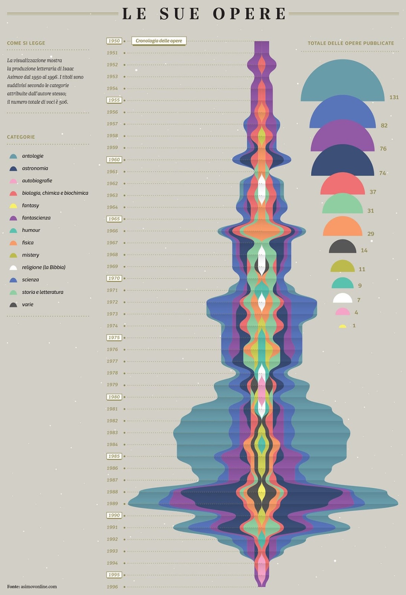
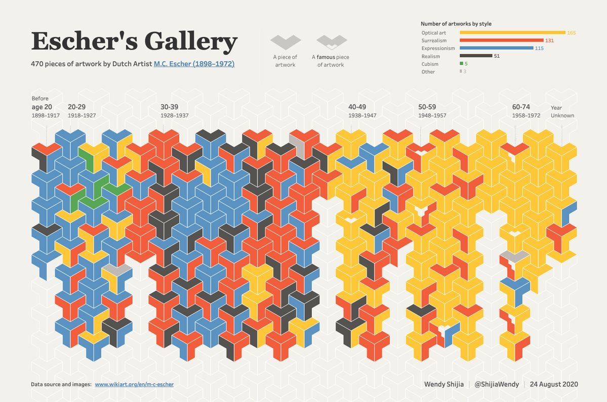
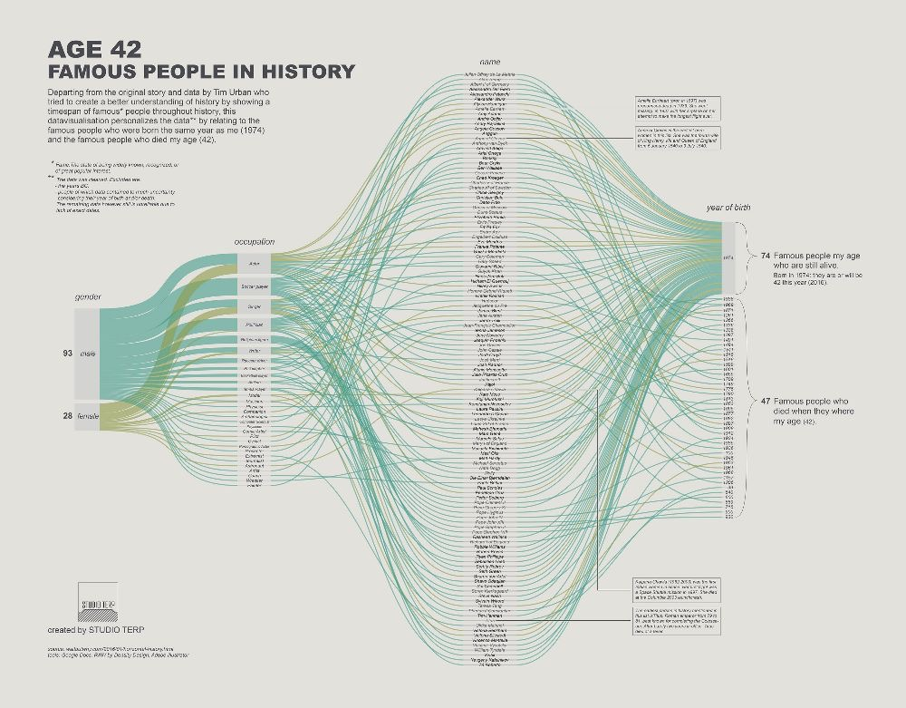
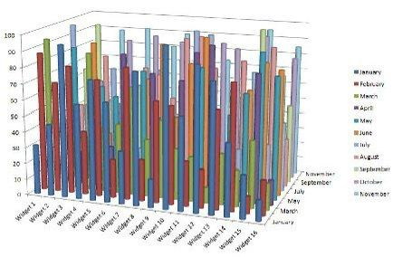

# Elilya Octaviani
# 122450009
# RC

## Good category visualizations

### Kedua visualisasi diatas termasuk dalam kategori visualisasi good karena:
### 1. **Strive for forms and functions**:
   - Bentuk kedua visualisasi data diatas memiliki warna dan bentuk yang jelas sehingga dapat dengan jelas memudahkan pengguna membandingkan setiap variabel yang ada.

### 2. **Justifying the selection of everything we do**:
   - Penggunaan visualisasi data pada kedua gambar diatas menjelaskan perbedaan antarvariabel dengan warna yang sangat kontras sehingga pengguna dapat membuat keputusan dengan alasan yang berdasarkan fakta melalui visualisasi data tersebut.

### 3. **Creating accessibility through intuitive design**:
   - Meskipun kedua visualisasi diatas memiliki bentuk yang tidak familiar oleh para pengguna namun dengan adanya label variabel dan informasi warna terhadap variabel dapat membuat pengguna dapat memahami konteks visualisasi data yang diberi.
  
### 4. **Never deceive the receiver**:
   - Data yang digunakan dalam membuat visualisasi ini tidak dikurang-lebihkan namun memiliki informasi yang akurat meskipun telah melewati proses dalam membuat visualisasi data.

\
\

## Bad category visualizations

### Kedua visualisasi diatas termasuk dalam kategori visualisasi bad karena:
### 1. **Strive for forms and functions**:
   - Bentuk visualisasi pada gambar pertama terlalu banyak garis dan pemilihan warna yang hampir sama antarvariabel, lalu pada visualisasi kedua menggunakan grafik 3D yang sulit untuk dilihat informasinya oleh pengguna.

### 2. **Justifying the selection of everything we do**:
   - Penggunaan grafik pada visualisasi data pertama tidak cocok untuk menggunakan grafik garis karena data yang diperoleh terlalu banyak sehingga perpotongan garis tidak dapat terlihat jelas, pada visualisasi yang kedua hanya grafik terdepan saja yang dapat terlihat namun yang terbelakang tidak dapat terlihat dengan jelas.

### 3. **Creating accessibility through intuitive design**:
   - penggunaan grafik pada visualisasi data pertama tidak cocok untuk menggunakan grafik garis karena data yang diperoleh terlalu banyak sehingga perpotongan garis tidak dapat terlihat jelas, pada visualisasi yang kedua hanya grafik terdepan saja yang dapat terlihat namun yang terbelakang tidak dapat terlihat dengan jelas.
  
### 4. **Never deceive the receiver**:
   - Kedua grafik memiliki sumbu/label yang sulit dipahami oleh pengguna seperti visualisasi pada gambar pertama memiliki label pada sebelah kanan dan kiri lalu pada gambar visualisasi kedua memiliki lebih dari dua label karena visualisasi berbentuk 3D.
